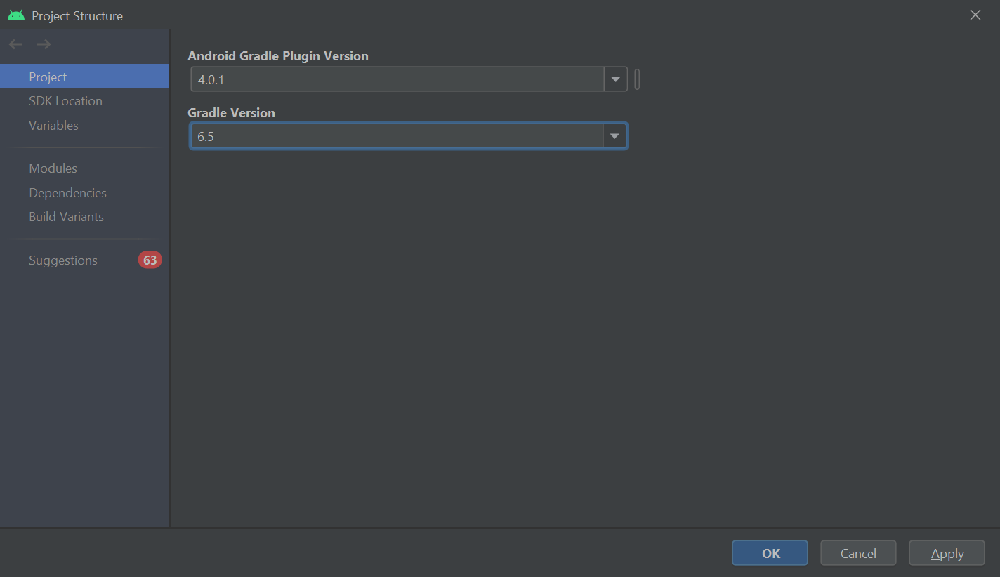
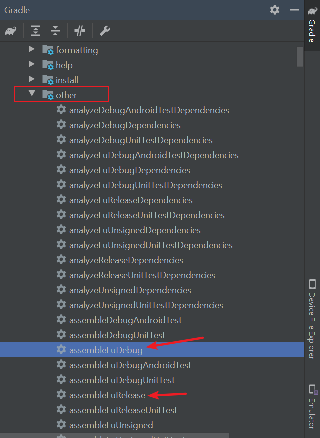
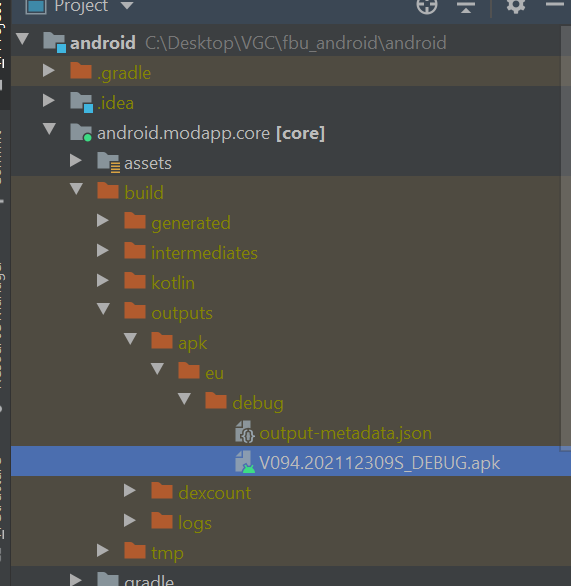
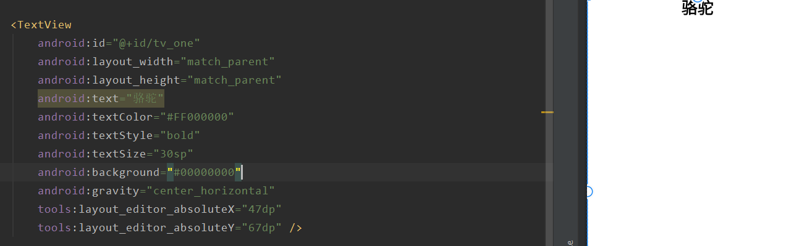
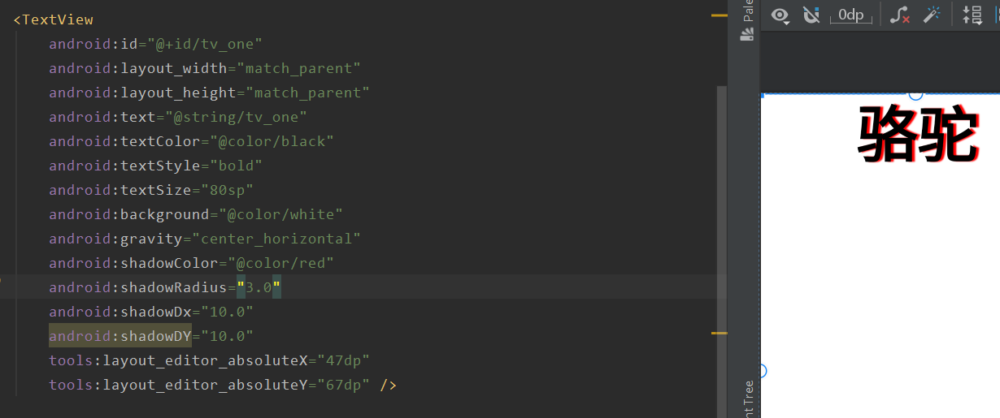
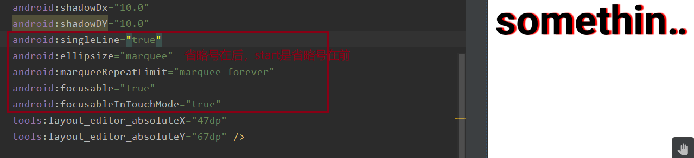
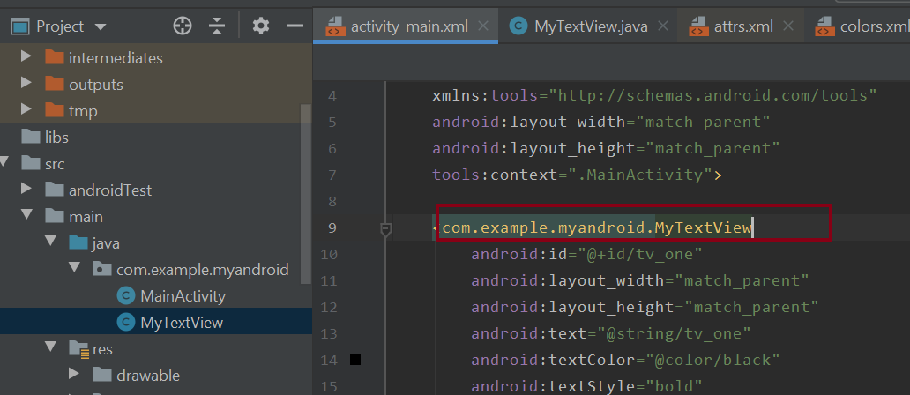
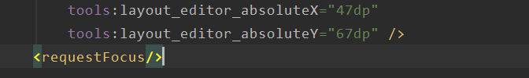

## Android Studio 4.1.1 Widnows版本安装与配置

https://blog.csdn.net/weixin_44171004/article/details/109747594   安装指南

google中国建站

https://developer.android.google.cn/

https://developer.android.google.cn/studio/features

环境安装

https://www.cnblogs.com/auguse/p/13807169.html

https://www.bilibili.com/video/BV1yW411B7Fr?p=2

https://blog.csdn.net/lance666/article/details/105469146


## VGC项目

### 项目配置




### 打包

打包APK如下





### ADB安装应用


### 账号注册

https://sso.vw.com.cn/login?appId=a386e6da502d9105948c85acaf44fa38&backUrl=https%3A%2F%2Fwww.vwcarnet.com.cn%2Fweb%2Fguest%2Fhome%2F-%2Fsso%2Flogin&lang=zh_CN&page=reg


## Android开发

https://www.bilibili.com/video/BV1Jb4y187C4?from=search&seid=15513953455901535513&spm_id_from=333.337.0.0

https://www.runoob.com/android/android-overview.html


### 项目结构介绍

https://www.bilibili.com/video/BV1Jb4y187C4?p=7&spm_id_from=pageDriver


### 控件TextView

#### 基础属性详解

> 1. layout_width：组件的宽度
> 2. layout_height：组件的高度
> 3. id：为TextView设置一个组件id
> 4. text：设置显示的文本内容
> 5. textColor：设置字体颜色
> 6. textStyle：设置字体风格，三个可选值：normal(无效果)，bold(加粗)，italic(斜体)
> 7. textSize：字体大小，单位一般是用sp
> 8. background：控件的背景颜色，可以理解为填充整个控件的颜色，可以是图片
> 9. gravity：设置控件中内容的对齐方向，TextView中是文字，ImageView中是图片等等。

> **layout**
>
> 
>
> **id**
>
> ```xml
> <TextView
>     android:id="@+id/tv_one"		这个id就是tv_one,前面的@+id/是自动生成的
>     android:layout_width="match_parent"
>     android:layout_height="match_parent"
>     />
> ```
>
> 这个id的作用就是给java代码获取对应控件的，如下，可以通过`findViewById(R.id.idname)；`获取这个控件,然后对控件采取一些操作。这里的setText就会覆盖在activity_main.xml中设置的`android.text`设置的内容
>
> 
>
> text/textColor/textStyle/textSize/background/gravity
>
> 
>
> `color中8个0，前两个是透明度，后面是r g b`
>
> 注意，项目中的text和textColor/background一般不会这么写，而是全部集成到colors.xml、strings.xml中
>
> 
>
> 
>
> 而ativity_mian.xml就可以直接调用
>
> 


#### 带阴影的textView

> android:shadowColor:设置阴影颜色,需要与shadowRadius一起使用
> android:shadowRadius:设置阴影的模糊程度,设为0.1就变成字体颜色了,建议使用3.0
> android:shadowDx:设置阴影在水平方向的偏移,就是水平方向阴影开始的横坐标位置
> android:shadowDy:设置阴影在竖直方向的偏移,就是竖直方向阴影开始的纵坐标位置
>
> 


#### 跑马灯的textView

> android:singleLine:内容单行显示
> android:focusable:是否可以获取焦点
> android:focusablelnTouchMode:用于控制视图在触摸模式下是否可以聚焦
> android:ellipsife:在哪里省略文本
> android:marqueeRepeatLimit:字幕动画重复的次数
>
> 
>
> 但现在要使其运行起来还需要为这个控件添加焦点，才能使他运行起来，一般有三种方式
>
> - `android:clickable="true"`表示点击获得焦点，一般需要点击后才会滚动，直接放在TextView中即可
>
> - 自定义一个TextView控件java类，继承TextView，实现一个isFocused()方法，返回true
>
>   ```java
>   package com.example.myandroid;
>   
>   import android.content.Context;
>   import android.util.AttributeSet;
>   import android.widget.TextView;
>   
>   import androidx.annotation.NonNull;
>   import androidx.annotation.Nullable;
>   
>   public class MyTextView extends TextView {
>   
>       public MyTextView(@NonNull Context context) {
>           super(context);
>       }
>   
>       public MyTextView(@NonNull Context context, @Nullable AttributeSet attrs) {
>           super(context, attrs);
>       }
>   
>       public MyTextView(@NonNull Context context, @Nullable AttributeSet attrs, int defStyleAttr) {
>           super(context, attrs, defStyleAttr);
>       }
>   
>       @Override
>       public boolean isFocused() {
>           return true;
>       }
>   }
>   ```
>
>   然后再控件中使用自己的控件
>
>   
>
> - 再<TextView>控件下使用<requestFocus/>
>
>   
