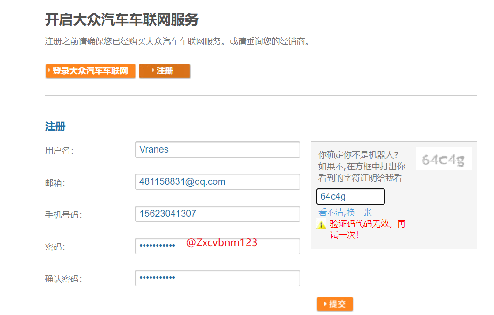

##  Android开发

https://www.bilibili.com/video/BV1Jb4y187C4?from=search&seid=15513953455901535513&spm_id_from=333.337.0.0

https://www.runoob.com/android/android-overview.html

## Android Studio 4.1.1 Widnows版本安装与配置

https://blog.csdn.net/weixin_44171004/article/details/109747594   安装指南

google中国建站

https://developer.android.google.cn/

https://developer.android.google.cn/studio/features

环境安装

https://www.cnblogs.com/auguse/p/13807169.html

https://www.bilibili.com/video/BV1yW411B7Fr?p=2

https://blog.csdn.net/lance666/article/details/105469146

## VGC项目

### 项目配置

### 打包

打包APK如下

### ADB安装应用

### 账号注册

https://sso.vw.com.cn/login?appId=a386e6da502d9105948c85acaf44fa38&backUrl=https%3A%2F%2Fwww.vwcarnet.com.cn%2Fweb%2Fguest%2Fhome%2F-%2Fsso%2Flogin&lang=zh_CN&page=reg

